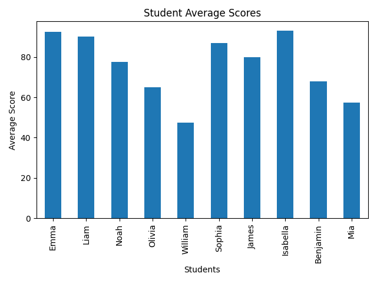

# Student Analyzer

A Python-based command-line tool designed to analyze and visualize student academic performance from CSV data.  
This project was developed as part of the Introduction to Python course at TU Dortmund.

---

## Features

- Data Loading: Automatically reads student data from a CSV file (`students.csv`)
- Performance Metrics: Calculates average scores across subjects (e.g., Math, Science)
- Automated Insights:
  - Identifies the top-performing student
  - Detects low-performing students (average < 60)
  - Categorizes overall class performance (Low, Moderate, Excellent)
- Visualization: Generates a bar chart of average scores using matplotlib

---

## Example Visualization

Below is an example of the generated bar chart:



---

## Installation

Make sure you have `uv` installed, then run:

```bash
uv pip install -e .
```

---

## Usage

Run the program with:

```bash
uv run -m student_analyzer
```

---

## Example Output

After running, the program generates a visualization and prints a summary:

```text
--- General Summary ---
Total students analyzed: 10
Overall class average score: 75.80
Top student: Isabella (93.00)

Low performers:
      name  average
4  William     47.5
9      Mia     57.5
```

---

## Notes

- The dataset should be provided as a CSV file
- You can modify the dataset to analyze different student groups

---

## License

This project was created for educational purposes.
